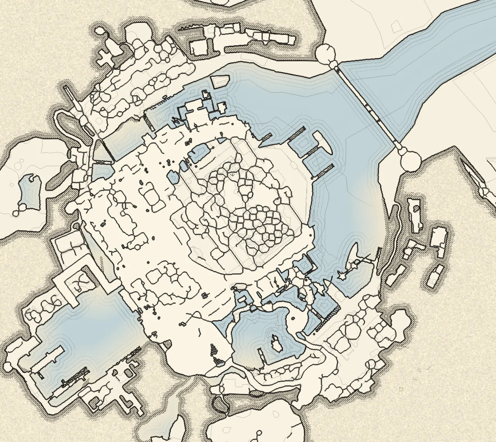

# M&M Cartographer

Zone maps for **Monsters & Memories** — pan, zoom, annotate, and follow the game
between zones automatically.

Runs on Linux and Windows. A single ~8 MB binary — no install, no runtime, no
git clone. It **builds the maps itself** from the copy of the game you already
own, so there is nothing else to download and no map data ships with it.



*The Underdocks harbour, at the finest zoom level — rendered from the game's own
mesh colliders, so what you see is what you can stand on.*

---

## Install

1. Download the build for your platform from
   [Releases](https://github.com/Noodle-face/mnm-cartographer/releases):
   - **Linux** — `mnm-cartographer-*-linux-x86_64.tar.gz`
   - **Windows** — `mnm-cartographer-*-windows-x64.zip`
2. Put it wherever you like and run it.

That is the whole install. The executable is self-contained: put it on a desktop,
a USB stick, anywhere. It does **not** need to live in the game folder, and it
writes everything it needs into your user data directory on first run.

On first launch you get a **No maps yet** panel. It looks for your game install,
and if it cannot find one you can point at it. Press **Generate maps** and it
builds every zone from the game's own files.

## Generating maps

Maps are rendered from the game's asset bundles on your own machine. Nothing is
downloaded, the game does not need to be running, and the game files are only
ever read.

Generated maps go to your data directory, not next to the executable:

```
~/.local/share/mnm-cartographer/maps/        Linux
%APPDATA%\mnm-cartographer\maps\             Windows
```

The whole set is about **150 MB** — roughly 19,000 tiles, WebP inside SQLite,
one file per zone, plus a map per floor for the twelve zones built on top of
themselves (see below). The scan finds 45 zones and about 43 produce a map; the
rest are unbuilt stubs with no walkable geometry. On an 8-core machine the whole
set takes around four minutes, about three without floors. How many zones build
at once depends on free memory, at roughly 6 GB each.

Each map is cut to the area a player can actually reach, with a thin margin.
Zone scenes carry their neighbours' scenery, leftover development copies and
backdrop terrain; the generator drops those, using the zone's own invisible
walls where it has them and where you can walk where it does not.

### Floors

Zones built on top of themselves -- Blind Midden, King Pyrotr's Fortress, the
crypts and others -- also get a map per floor. A **Floors** table on the map
switches between them; the top-level map is the default. In the Maps panel each
floor can be ticked off to skip it, and **Floors only** rebuilds just the floors
of the selected zones, keeping their top-level maps.

### The Maps panel

**Maps…** in the sidebar opens it at any time, not just on a first run:

- the detected install, and a folder picker if it guessed wrong
- every zone your install ships, read from the bundles themselves, each marked
  if already built
- a filter box and **All / None / Missing only**
- **Rebuild N selected** — rebuilds exactly those, even if they already exist
- **Build missing** — fills in gaps only

Progress shows the zone being built, which of its four zoom levels is in flight,
elapsed time and an estimate measured from the zones already done. **Cancel**
stops between zones, and generating again **resumes** rather than starting over:
a finished map is skipped before its (up to 2 GB) bundle is even opened.

If the game updates, press **Rescan** — the zone list is cached against each
bundle's size and timestamp, so it is only re-read when something changed.

## Using it

| | |
|---|---|
| drag | pan |
| wheel | zoom (fit is as far out as it goes) |
| `F` / `Home` | fit the whole map |
| `Q` / `E` | turn the map 15° left / right |
| middle-drag | turn the map freely |
| drag the compass | turn the map; click it for north up (or `N`) |
| `PgUp` / `PgDn` | step through floors, in zones that have them |
| `Ctrl+Z` | undo the last marker edit |
| shift + right-click | copy a location to paste in chat |
| right-click the map | add a marker |
| left-click a marker | open its note, or follow its link |
| right-click a marker | edit or delete |
| drag a marker | move it |
| `Esc` | close the dialog |

Each zone remembers its own rotation. The compass in the top right turns with
the map, so north is always readable.

**Experimental → Paint this map** in the sidebar renders the open zone in a
full-colour painted style from your game files, in the background, in about
half a minute. **Show painted style** then switches between it and the inked
map; markers sit in the same place on both. The palette is desert, so it suits
sandy zones best for now.

The readout is in **game world coordinates**. Markers are stored in world space,
so they stay put across zoom levels.

**Follow game** tails the game's own `Player.log` for its zone line
(`[Client][ZONE] Start zoning process to …`) and switches map as you zone. It
reads that one file and nothing else — it does not modify the client, read its
memory, or touch its network traffic.

**Exits to find** lists each zone's connections from the community
[Zone Connection Map](https://monstersandmemories.miraheze.org/wiki/Zone_Connection_Map),
ticked green once you have placed a marker for one. The wiki gives topology,
not positions, so most of these are yours to place as you find them.

### Marker kinds

| | shape | meaning |
|---|---|---|
| camp | circle | A pull spot or sit-and-fight camp |
| named | star | Named or rare spawn |
| harvest | diamond | Resource node: ore, herb, wood |
| merchant | square | Vendor, banker or trainer |
| exit | hexagon | Zone connection, stairs or portal |
| quest | pentagon | Quest giver or turn-in |
| danger | triangle | Avoid: KOS mob, roamer, drop or trap |
| note | cross | Anything else worth remembering |

Shape carries identity, not colour: eight categorical colours cannot all be
told apart (the best assignment scores a worst-pair OKLab dE of 13.7 against a
floor of 15, and 3.9 under simulated deuteranopia), so the silhouette does the
work and colour reinforces it.

Markers are plain JSON in `markers/<zone>.json`, in world coordinates — diff
them, share them, or hand-edit them.

### Requirements

Any marker, but mostly quests, can record **who can actually use it**: a minimum
level, classes, a faction or standing, and anything else gating it — a
prerequisite quest, an item, a key. These are fields rather than prose buried in
the note, so the hover tooltip can say it in one line:

> requires level 20 · Cleric, Druid · Ashira

Leave a field blank for "no requirement". They are stored under `reqs` and are
omitted from the file entirely when empty, so existing marker files are
unaffected.

### Finding things

With a community pack imported, a zone can hold hundreds of markers. The marker
list has a **find** box over labels, notes and requirements, a checkbox per kind,
and **mine / imported** toggles -- so you can hide someone else's clutter
without deleting their work. Clicking a marker in the list centres the map on
it. The zone dropdown filters as you type.

Every marker remembers where it came from: blank for ones you placed, otherwise
the pack it arrived in, shown as a dot in the list and on hover.

### Sharing markers

Any marker can be copied as a single line to paste into chat:

```
mnm1|underdocks|camp|-2500.0|2000.0|Griffon camp|pull from the north
```

Whoever receives it opens **Share…**, pastes it, and the marker lands on their
map in the right zone, switching zones if needed. The format is readable on purpose: you can see where it
points before trusting it.

For more than one marker there are **packs** -- a JSON file of markers across
any number of zones, written by **Export** and read by **Import**. Importing
skips anything you already have within 12 world units of the same kind, so
re-importing an updated pack adds only what is new rather than duplicating a
camp everyone already marked. Importing shows what it would add, per zone,
before writing anything.

### Linking markers

Two markers can be paired with the **Linked to** dropdown. Hovering either end
draws a dashed connector to the other; clicking jumps to it. Only one end needs
setting up — the link is followed in both directions.

This exists because the game ships no teleporter destination data: the pads are
scenery with no target recorded client-side, so pairs have to be walked and
noted by hand. The `link` field takes a bare marker id for the same zone, or
`<zone-slug>:<id>` to cross zones.

---

## Command line

Everything here is optional — the GUI does all of it, and most people will never
open a terminal. Commands are identical on both platforms; only the way you name
the program differs.

**Linux** (from the folder you unpacked it into):

```bash
./mnm-cartographer --check
```

**Windows** (PowerShell or Command Prompt, from the same folder):

```powershell
.\mnm-cartographer.exe --check
```

The examples below use the Linux form. Drop the `./` and add `.exe` for Windows.

| command | what it does |
|---|---|
| `mnm-cartographer` | open the app |
| `mnm-cartographer <dir>` | use `<dir>` for markers and `connections.json` |
| `--version`, `-V` | print the version |
| `--check` | what it found: version, search paths, zones, wiki edges, markers, the game log, and every marker link |
| `--list-zones` | every zone your install ships, read from the game files, each marked `[x]` if built |
| `--generate` | build all missing maps, no window |
| `--generate <zone>` | build only zones matching that text, e.g. `--generate underdocks` |
| `--generate --force` | rebuild even if the map already exists |
| `--generate --out <dir>` | write maps somewhere other than the data directory |
| `--clean` | delete generated maps (never touches markers or `connections.json`) |
| `--clean --all` | also drop the zone cache, so the next run rescans every bundle |
| `--log <path>` | point at a specific `Player.log` if auto-detection fails |
| `--share [text]` | print share codes for markers whose id or label matches |
| `--export <file>` | write all markers as a pack others can import |
| `--export <file> --zone <slug>` | just one zone |
| `--import <file>` | merge a pack in, skipping markers you already have |

Two environment variables:

| | |
|---|---|
| `MNM_BUNDLES` | the game's `StandaloneWindows64` folder, overriding auto-detection |
| `MNM_PROFILE` | print per-stage timings while generating (one zone at a time) |

Setting one for a single command:

```bash
MNM_BUNDLES=/path/to/mnm_Data/StreamingAssets/aa/StandaloneWindows64 \
  ./mnm-cartographer --list-zones
```

```powershell
$env:MNM_BUNDLES = "C:\Games\Monsters and Memories\mnm_Data\StreamingAssets\aa\StandaloneWindows64"
.\mnm-cartographer.exe --list-zones
```

### Typical use

```bash
./mnm-cartographer --list-zones            # what can be built
./mnm-cartographer --generate              # build everything missing
./mnm-cartographer --generate shadeddunes  # or just one
./mnm-cartographer --check                 # confirm it found them
./mnm-cartographer                         # open the app
```

The same on Windows:

```powershell
.\mnm-cartographer.exe --list-zones
.\mnm-cartographer.exe --generate
.\mnm-cartographer.exe --generate shadeddunes
.\mnm-cartographer.exe --check
.\mnm-cartographer.exe
```

Testing from a clean slate:

```bash
./mnm-cartographer --clean --all     # .\mnm-cartographer.exe --clean --all
./mnm-cartographer --generate
```

### Developer commands

Only useful if you are working on the renderer:

| | |
|---|---|
| `--selftest` | check the image-processing primitives against known values |
| `--debug-markers <n>` | scatter n markers per zone, to exercise the UI at volume |
| `--clean-markers` | remove those again, leaving real markers alone |
| `--dump-paper` | write the procedural parchment texture to `paper.png` |
| `--extract <bundle> <scene>` | report the geometry a scene yields |
| `--render <bundle> <scene> <ppu> <out.png>` | render one zone at one resolution |

## Where maps come from

Maps are rendered from the game's own Addressables bundles: the geometry is the
zones' **mesh colliders**, so what the map shows is what you can stand on.
Up-facing surfaces become floor, ceilings are discarded, walls are found as
height discontinuities with the local slope subtracted out, and water is floor
below the sea level each zone's own water objects sit at.

Each zoom level is rendered natively rather than downsampled, because style
constants are in pixels and geometry thresholds are in world units — that split
is why zooming in reveals more detail instead of magnifying the same picture.

The rendered maps are derived from Niche Worlds Cult's copyrighted art. They are
generated on your machine from your own install and are deliberately **not**
distributed with this program; please keep them to yourself.

## Building from source

Rust 1.75+ and nothing else:

```bash
cargo build --release
./target/release/mnm-cartographer
```

For a binary you intend to **give to someone else**, strip the build machine's
paths first:

```bash
RUSTFLAGS="--remap-path-prefix=$HOME=~" cargo build --release
```

rustc bakes source paths into panic messages, and for dependencies those sit
under your home directory — so an unremapped binary carries your username and
home layout. CI already does this for released builds.

The result is a single **~8 MB** self-contained binary — no runtime, no
installer, no bundled interpreter. egui draws its own UI on the GPU, so there is
no system GUI toolkit to go missing on a user's machine, and `connections.json`
and the seed markers are compiled in, so a lone executable is complete.

Linux build needs the usual graphics headers
(`libgl1-mesa-dev libxkbcommon-dev libwayland-dev`); see the CI workflow.

### Cutting a release

1. Bump `version` in `Cargo.toml`, commit it.
2. Tag it with a matching `v` prefix and push the tag:

   ```bash
   git tag -a v0.0.1 -m "v0.0.1" && git push origin v0.0.1
   ```

3. CI builds both platforms, checksums them, and opens a **draft** release.
4. Download the artifacts, check they run, then publish the draft.

The tag and `Cargo.toml` must agree or the build fails on purpose: the version
reaches `--version`, the title bar and the stamp written into every generated
map, so a mismatch ships a binary that misreports itself.

The version lives in `Cargo.toml` and nowhere else: the title bar, `--version`,
`--check` and the `generator` stamp written into every map all read it, so they
cannot disagree.


## Credit

Zone connection data from the community
[Monsters and Memories Wiki](https://monstersandmemories.miraheze.org/).
Not affiliated with or endorsed by Niche Worlds Cult.
